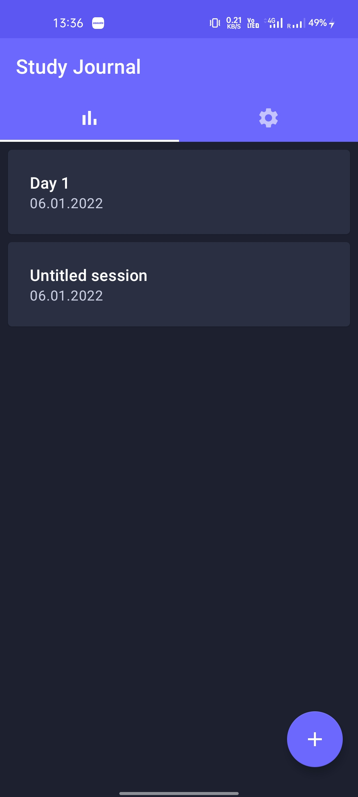
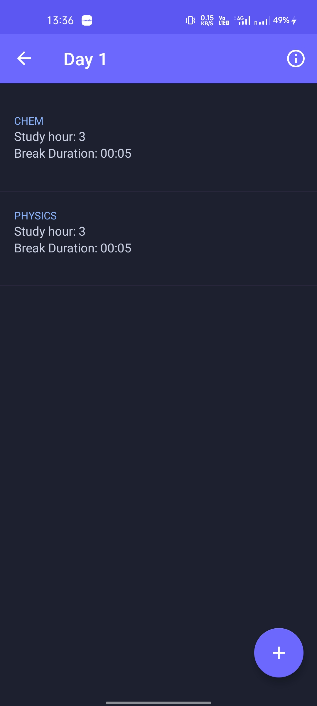
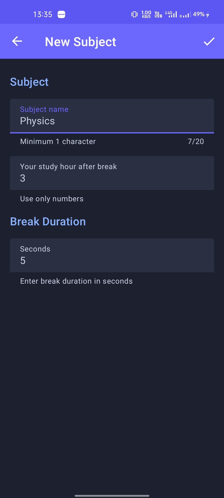
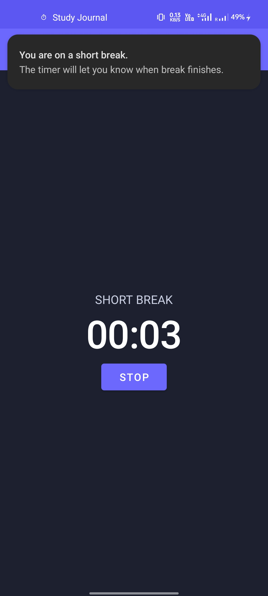
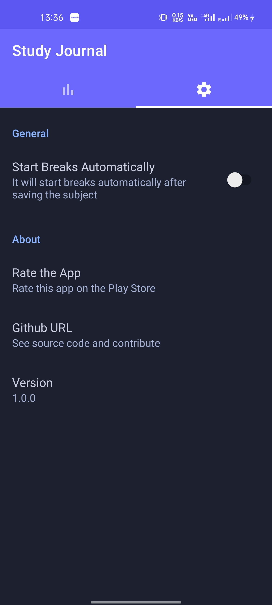

<h1 align="center">Study Journal</h1>

An android application for creating a journal for subjects you studied and also you can set timer for break between two consecutive
subjects.

## MAD Score

## Screenshots

## Tech stack & Open-source libraries

### Language

- [Kotlin](https://kotlinlang.org)
- [Coroutines](https://kotlinlang.org/docs/coroutines-overview.html)
  & [Flow](https://kotlinlang.org/docs/flow.html) for asynchronous programming

### Android Software Development Kit

- Target level 31
- Minimum level 23

### Jetpack Libraries

- [Recyclerview](https://developer.android.com/jetpack/androidx/releases/recyclerview) - for creating
  dynamic lists
- [Preferences](https://developer.android.com/jetpack/androidx/releases/preference) - interactive
  settings screens
- [Room Persistence](https://developer.android.com/jetpack/androidx/releases/room) - an abstraction
  layer over SQLite
- [Navigation](https://developer.android.com/jetpack/androidx/releases/navigation) - a framework for
  navigating between 'destinations'
- [Lifecycle](https://developer.android.com/jetpack/androidx/releases/lifecycle) - lifecycle-aware
  components

### Open-source Libraries

- [Dagger Hilt](https://dagger.dev/hilt/) - a dependency injection library for Android
- [ViewBindingDelegate](https://github.com/kirich1409/ViewBindingPropertyDelegate) - a property
  delegate for [ViewBinding](https://developer.android.com/topic/libraries/view-binding)

### Test Libraries

- [JUnit](https://junit.org/junit4/) - a simple framework to write repeatable tests
- [Espresso](https://developer.android.com/training/testing/espresso) - Android UI tests
- [MockK](https://mockk.io) - a mocking library for Kotlin

## Contact

Prasoon Kumar - [LinkedIn](https://linkedin.com/in/prasoon0) - [Email](mailto:prasoonk187@gmail.com) - [Facebook](https://www.facebook.com/prasoon0)
